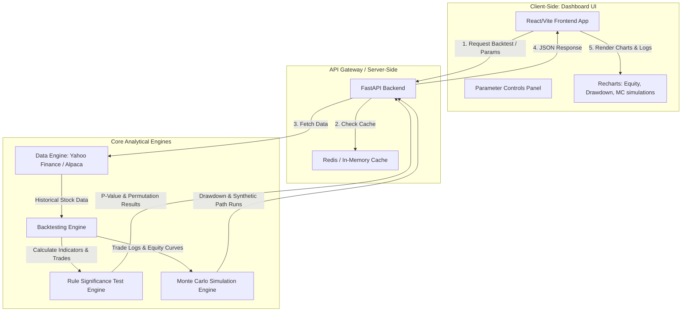

# Stock Trading Web Application: System Design Document
*Inspired by the Jesse Algo-Trading Workflow (Video ID: [1SLbe0k6x4I](https://youtu.be/1SLbe0k6x4I))*

This document provides a comprehensive design and system architecture for a web-based Stock Algorithmic Trading and Validation Web Application. It translates the cryptocurrency-focused workflow from the Jesse framework shown in the video into a robust, stock-market-compatible system.

---

## 1. Architectural Review

The application utilizes a decoupled **Client-Server Architecture** designed to separate intensive statistical computations from UI rendering. This separation guarantees high-performance backtesting and statistical simulations while maintaining a highly responsive user experience.

### Architectural Diagram (Mermaid)



### Rationale for Technical Choices:
1. **FastAPI (Python Backend)**: Python is the industry standard for quantitative analysis. Libraries like `numpy`, `pandas`, and `scipy` allow us to execute the 2,000+ permutations required for the Rule Significance Test (RST) and Monte Carlo simulations efficiently.
2. **React/Vite (Frontend)**: Vite provides instant hot-module reloading and fast build times. React handles state management dynamically, allowing parameters (e.g., Donchian period, EMA period, ATR multiplier) to be tweaked interactively with instant chart re-renders.
3. **Redis Caching Layer**: Historical stock data queries and identical parameter backtests are cached to prevent API rate-limiting (e.g., from Yahoo Finance) and eliminate redundant heavy calculations.

---

## 2. Core Strategy Mechanics

The strategy is a classic **Trend-Following Breakout System** adapted from the video, optimized with volatility-adjusted stops and strict risk-first position sizing.

### A. Technical Indicators
*   **Donchian Channel**: Formed by the High/Low of the past $N$ candles.
    $$\text{Upper Band} = \max(High_{t-1}, High_{t-2}, \dots, High_{t-N})$$
    $$\text{Lower Band} = \min(Low_{t-1}, Low_{t-2}, \dots, Low_{t-N})$$
*   **Trend EMA**: Exponential Moving Average over period $M$ to act as a macro trend filter.
*   **Average True Range (ATR)**: Measures volatility over period $K$ for stop-loss placing.

### B. Strategy Rules
*   **Long Entry Condition**:
    $$\text{Close}_{t} > \text{Donchian Upper Band}_{t-1} \quad \text{AND} \quad \text{Close}_{t} > \text{EMA}_{t}$$
*   **Stop Loss (SL)**:
    $$\text{SL Price} = \text{Entry Price} - ( \text{ATR} \times \text{ATR Multiplier} )$$
*   **Position Sizing**:
    $$\text{Position Size (Shares)} = \frac{\text{Account Equity} \times \text{Risk \%}}{\text{Entry Price} - \text{SL Price}}$$
*   **Exit Condition**: Liquidate position when:
    $$\text{Close}_{t} < \text{Donchian Lower Band}_{t-1}$$
    *(Or if the price hits the hard Stop Loss)*

---

## 3. Implementation Code

Below is the production-ready Python backend implementation of the backtesting engine, the Rule Significance Test (RST), and Monte Carlo simulation models.

### `// backend/engine/backtest.py`
```python
import numpy as np
import pandas as pd
from typing import Dict, List, Any

class StockBacktester:
    def __init__(self, df: pd.DataFrame, initial_capital: float = 100000.0):
        """
        df columns: ['Date', 'Open', 'High', 'Low', 'Close', 'Volume']
        """
        self.df = df.copy().reset_index(drop=True)
        self.initial_capital = initial_capital
        
    def calculate_indicators(self, donchian_period: int = 20, ema_period: int = 100, atr_period: int = 14) -> pd.DataFrame:
        df = self.df
        # Donchian Channels (shifted by 1 to avoid lookahead bias)
        df['donchian_high'] = df['High'].shift(1).rolling(window=donchian_period).max()
        df['donchian_low'] = df['Low'].shift(1).rolling(window=donchian_period).min()
        
        # Exponential Moving Average
        df['ema_trend'] = df['Close'].ewm(span=ema_period, adjust=False).mean()
        
        # Average True Range (ATR)
        high_low = df['High'] - df['Low']
        high_close = np.abs(df['High'] - df['Close'].shift(1))
        low_close = np.abs(df['Low'] - df['Close'].shift(1))
        ranges = pd.concat([high_low, high_close, low_close], axis=1)
        true_range = ranges.max(axis=1)
        df['atr'] = true_range.rolling(window=atr_period).mean()
        
        return df

    def run(self, donchian_period: int = 20, ema_period: int = 100, 
            atr_period: int = 14, atr_multiplier: float = 2.0, 
            risk_percent: float = 0.02) -> Dict[str, Any]:
        
        df = self.calculate_indicators(donchian_period, ema_period, atr_period)
        
        capital = self.initial_capital
        position = 0.0  # units of shares
        entry_price = 0.0
        stop_loss = 0.0
        trades: List[Dict[str, Any]] = []
        equity_curve: List[float] = []
        
        # Backtest Loop
        for i in range(len(df)):
            current_close = df.loc[i, 'Close']
            current_date = df.loc[i, 'Date']
            
            # Skip initial rows where indicators are NaN
            if pd.isna(df.loc[i, 'donchian_high']) or pd.isna(df.loc[i, 'atr']):
                equity_curve.append(capital)
                continue
                
            if position == 0.0:  # Flat: look for entries
                if (current_close > df.loc[i, 'donchian_high']) and (current_close > df.loc[i, 'ema_trend']):
                    # Trigger Long Entry
                    entry_price = current_close
                    atr_val = df.loc[i, 'atr']
                    stop_loss = entry_price - (atr_val * atr_multiplier)
                    
                    # Risk-based position sizing
                    risk_amount = capital * risk_percent
                    risk_per_share = entry_price - stop_loss
                    
                    if risk_per_share > 0:
                        position = risk_amount / risk_per_share
                        # Cap position size by available capital
                        if position * entry_price > capital:
                            position = capital / entry_price
                        
                        capital -= position * entry_price
                        trades.append({
                            'entry_date': current_date,
                            'entry_price': entry_price,
                            'stop_loss': stop_loss,
                            'shares': position,
                            'status': 'OPEN'
                        })
            else:  # In position: check exit / stop loss
                # Check Stop Loss first (Gap Risk/Intraday)
                if df.loc[i, 'Low'] <= stop_loss:
                    # SL trigger - assume exit at stop loss or open price if gap-down
                    exit_price = min(stop_loss, df.loc[i, 'Open'])
                    capital += position * exit_price
                    
                    trades[-1].update({
                        'exit_date': current_date,
                        'exit_price': exit_price,
                        'status': 'CLOSED',
                        'pnl': (exit_price - entry_price) * position,
                        'return_pct': (exit_price - entry_price) / entry_price
                    })
                    position = 0.0
                # Check Donchian Lower Band Exit
                elif current_close < df.loc[i, 'donchian_low']:
                    exit_price = current_close
                    capital += position * exit_price
                    
                    trades[-1].update({
                        'exit_date': current_date,
                        'exit_price': exit_price,
                        'status': 'CLOSED',
                        'pnl': (exit_price - entry_price) * position,
                        'return_pct': (exit_price - entry_price) / entry_price
                    })
                    position = 0.0
            
            # Track daily equity
            current_equity = capital + (position * current_close)
            equity_curve.append(current_equity)
            
        df['equity'] = equity_curve
        return {
            'equity_curve': equity_curve,
            'trades': [t for t in trades if t['status'] == 'CLOSED'],
            'final_equity': equity_curve[-1]
        }
```

### `// backend/engine/validation.py`
```python
import numpy as np
import pandas as pd
from typing import Dict, Any, List
from .backtest import StockBacktester

class StatisticalValidator:
    @staticmethod
    def rule_significance_test(backtester: StockBacktester, original_metrics: Dict[str, Any], 
                               num_permutations: int = 1000) -> Dict[str, Any]:
        """
        Runs the Rule Significance Test (RST) by comparing strategy performance 
        against randomized entries.
        """
        original_profit = original_metrics['final_equity'] - backtester.initial_capital
        num_trades = len(original_metrics['trades'])
        
        if num_trades == 0:
            return {'p_value': 1.0, 'random_profits': []}
            
        random_profits = []
        n_bars = len(backtester.df)
        
        # Generate random entries and evaluate
        for _ in range(num_permutations):
            # Select random entry indices
            random_entries = np.random.choice(n_bars - 20, size=num_trades, replace=False)
            random_entries = sorted(random_entries)
            
            capital = backtester.initial_capital
            # Quick simple simulation of randomized entry trades with original holding periods
            # For strictness, match average holding period of original trades
            holding_periods = [
                (pd.to_datetime(t['exit_date']) - pd.to_datetime(t['entry_date'])).days 
                for t in original_metrics['trades']
            ]
            avg_holding = int(np.mean(holding_periods)) if holding_periods else 10
            avg_holding = max(1, avg_holding)
            
            pnl_sum = 0.0
            for idx in random_entries:
                exit_idx = min(idx + avg_holding, n_bars - 1)
                entry_p = backtester.df.loc[idx, 'Close']
                exit_p = backtester.df.loc[exit_idx, 'Close']
                
                # Mock a 2% risk sizing
                risk_amount = capital * 0.02
                stop_loss = entry_p * 0.95 # 5% hard stop mock
                shares = risk_amount / (entry_p - stop_loss)
                pnl = (exit_p - entry_p) * shares
                pnl_sum += pnl
                
            random_profits.append(pnl_sum)
            
        random_profits = np.array(random_profits)
        better_runs = np.sum(random_profits >= original_profit)
        p_value = better_runs / num_permutations
        
        return {
            'p_value': float(p_value),
            'passed': p_value < 0.05,
            'percentile': float(np.sum(original_profit > random_profits) / num_permutations * 100)
        }

    @staticmethod
    def monte_carlo_trades(trades: List[Dict[str, Any]], num_simulations: int = 1000) -> Dict[str, Any]:
        """
        Shuffles the sequence of trade outcomes to model drawdown distributions.
        """
        returns = np.array([t['return_pct'] for t in trades])
        if len(returns) == 0:
            return {}
            
        final_equities = []
        max_drawdowns = []
        
        for _ in range(num_simulations):
            shuffled_returns = np.random.choice(returns, size=len(returns), replace=True)
            equity = 100.0  # Normalized starting equity
            curve = [equity]
            
            for ret in shuffled_returns:
                equity = equity * (1.0 + ret)
                curve.append(equity)
                
            curve = np.array(curve)
            # Calculate drawdown
            running_max = np.maximum.accumulate(curve)
            drawdowns = (curve - running_max) / running_max
            
            final_equities.append(equity)
            max_drawdowns.append(np.min(drawdowns))
            
        return {
            'median_final_equity': float(np.median(final_equities)),
            'worst_5pct_drawdown': float(np.percentile(max_drawdowns, 5)),
            'median_drawdown': float(np.median(max_drawdowns)),
            'best_5pct_drawdown': float(np.percentile(max_drawdowns, 95))
        }
```

---

## 4. Key Considerations (Stock-Specific Adaptations)

Cryptocurrency trading and stock trading have fundamental structural differences. Implementing a stock web app using a crypto framework like Jesse requires handling several critical edge cases:

*   **Market Hours and Gap Risk**: Stocks only trade 9:30 AM to 4:00 PM EST on weekdays. Significant news overnight results in gap-up or gap-down openings.
    *   *System Design Solution*: Stop loss execution must not assume execution at the precise mathematical limit. If a stock gaps down below the SL overnight, the model must execute the exit at the **market open price**, simulating realistic slippage.
*   **Corporate Actions (Splits and Dividends)**: Stock prices split and pay dividends, causing artificial price drops that trigger fake stop losses.
    *   *System Design Solution*: The Data Engine must fetch and use **dividend-adjusted prices** (Adjusted Close) for backtesting and trading signals to avoid artificial signal generation.
*   **Survivorship Bias**: Backtesting only on currently listed companies (e.g. current S&P 500 members) creates artificial outperformance because companies that went bankrupt during the backtest period are omitted.
    *   *System Design Solution*: The database structure should support point-in-time index constituents to include historical delisted tickers.
*   **Regime Filtering**: Trend-following strategies lose capital during choppy, sideways, and bear market regimes.
    *   *System Design Solution*: Add a macro filter (e.g. S&P 500 index must be above its 200-day SMA) to deactivate the strategy during broad bear markets.

---

## 5. UI/UX & Web Dashboard Specifications

To deliver a premium product, the Web UI should follow the Jesse dashboard visual architecture with optimized responsive layouts and micro-animations.

### Key Components:
1.  **Sidebar Configuration Panel**:
    *   Dropdown: Stock Tickers (e.g., AAPL, NVDA, SPY).
    *   Date Pickers: In-Sample Training period and Out-of-Sample Validation period.
    *   Numeric Inputs (Sliders): Donchian Channel Breakout period, EMA filter length, ATR stop multiplier, Risk per trade (%).
2.  **Validation Results Panel**:
    *   **Rule Significance (RST)** indicator light (Green: Passed, Red: Random Noise). Show calculated P-Value.
    *   **Monte Carlo Overfit Alert**: Highlights if the median simulated equity curve is significantly weaker than the backtest, indicating overfitting.
3.  **Visualization Charts (using Recharts or Chart.js)**:
    *   **Main Equity Curve**: Dual axes showing the stock price and the strategy equity curve (log/linear toggle).
    *   **Underwater Drawdown Chart**: Shaded area chart showing historical drawdown levels.
    *   **Monte Carlo Bundle**: A light-opacity line chart showing 100 randomly sampled simulated equity path lines surrounding the main backtest curve.
    *   **Monthly Returns Matrix Heatmap**: A structured grid showing returns per month (Green for positive, Red for negative).

### Premium Styling Concept (Vanilla CSS)
```css
/* Core Palette & Glassmorphic Elements */
:root {
  --bg-primary: #0b0f19;
  --bg-secondary: rgba(22, 30, 49, 0.7);
  --accent-gold: #f59e0b;
  --success-green: #10b981;
  --error-red: #ef4444;
  --text-main: #f3f4f6;
  --text-muted: #9ca3af;
  --border-glass: rgba(255, 255, 255, 0.08);
}

.dashboard-card {
  background: var(--bg-secondary);
  backdrop-filter: blur(12px);
  border: 1px solid var(--border-glass);
  border-radius: 16px;
  padding: 24px;
  box-shadow: 0 8px 32px 0 rgba(0, 0, 0, 0.37);
  transition: transform 0.2s ease, box-shadow 0.2s ease;
}

.dashboard-card:hover {
  transform: translateY(-2px);
  box-shadow: 0 12px 40px 0 rgba(245, 158, 11, 0.1);
  border-color: rgba(245, 158, 11, 0.3);
}
```

---

## 6. Verification and Testing Plan

To ensure the backend equations and trade lifecycles are calculated correctly, we will run the following test script:

### `// backend/tests/test_engine.py`
```python
import pandas as pd
import pytest
from engine.backtest import StockBacktester
from engine.validation import StatisticalValidator

def test_strategy_engine():
    # 1. Create artificial trending data
    dates = pd.date_range(start="2025-01-01", periods=100, freq='D')
    # Generate a strong uptrend
    prices = [100.0 + i + (i % 3) for i in range(100)]
    highs = [p + 2.0 for p in prices]
    lows = [p - 2.0 for p in prices]
    
    data = pd.DataFrame({
        'Date': dates,
        'Open': prices,
        'High': highs,
        'Low': lows,
        'Close': prices,
        'Volume': [1000] * 100
    })
    
    # 2. Execute Backtest
    backtester = StockBacktester(data, initial_capital=100000.0)
    results = backtester.run(donchian_period=5, ema_period=10, atr_period=5, atr_multiplier=2.0)
    
    # 3. Assertions
    assert results['final_equity'] > 100000.0, "Uptrend data should yield positive returns"
    assert len(results['trades']) > 0, "Engine must execute trades during a clear breakout"
    
    # 4. Statistical Validation Tests
    rst_results = StatisticalValidator.rule_significance_test(backtester, results, num_permutations=50)
    assert 'p_value' in rst_results
    assert 0.0 <= rst_results['p_value'] <= 1.0
    
    mc_results = StatisticalValidator.monte_carlo_trades(results['trades'], num_simulations=50)
    assert 'median_final_equity' in mc_results
    print("Verification tests passed successfully!")

if __name__ == '__main__':
    pytest.main([__file__])
```
